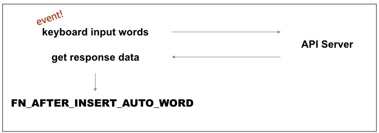
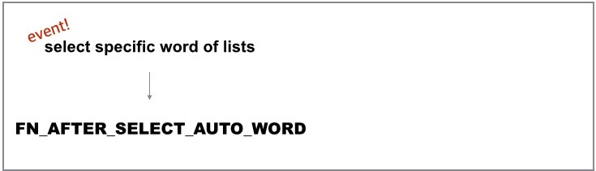

SweetSearch
============
SweetSearch is an Auto-Suggestion(Auto-Complete) component on mobile web.


## Feature

* lightweight (vanillaJS)
* multiple options 
* based on ES6 Syntax

## Demo

http://nigayo.github.io/..

## Install

* npm init
* gulp buildJS (concatenation and ES6 -> ES5)
* import script

```HTML
<script src="../dist/ss_merge_es5.js"></script>
```

## Usage
Component initialization and callback registration.

```JAVASCRIPT

        var oSS = new SweetSearch(elFormComtainer, {
            'sAutoCompleteURL'    : sAutoCompleteURLLocal,
            'AjaxRequestType'     : 'ajax', //jsonp, ajax, user
        });

        oSS.registerUserMethod({
            'FN_AFTER_INSERT_AUTO_WORD'    : fnInsertAutoCompleteWordAjax,
            'FN_AFTER_SELECT_AUTO_WORD'    : fnSelectAutoCompleteWord,
        });

```

You have to use a CSS classname or a ID as below:

* .input-wrap
* .input-field
* .auto-complete-wrap
* .close-layer
* .clear-query
* .auto-complete-wrap .ul-wrap
* #search-form

Details, You can refer to a demo page ( /demo/searchAmazon.html )

## Register callback

Arguments of registerUserMethod function used above are all callback functions.

```JAVASCRIPT
        'FN_AFTER_INSERT_AUTO_WORD'    : fnInsertAutoCompleteWordAjax,
        'FN_AFTER_SELECT_AUTO_WORD'    : fnSelectAutoCompleteWord,
```

#### 1.FN_AFTER_INSERT_AUTO_WORD ####
This callback function will be executed after Ajax response.


**[Example]**
```JAVASCRIPT
	var fnInsertAutoCompleteWordAjax = function(sQuery, aResultData) {
        var result  = "";
        var sHTML   = "";
        var sTemplate = "<li><span>[%sKeyword%]</span></li>";

        sData.items[0].forEach( function(v) {
            result = sTemplate.replace(/\[%sKeyword%\]/, v[0]);       
            sHTML += result;
        });
    }
```

You can use two argument as below.

**[Arguments]**

* sQuery(String) 	: search word.
* aResultData(String) : Ajax(JSONP) response data.

<br>
**[Return]**

* no return value

<br>

#### 2.FN_AFTER_SELECT_AUTO_WORD
This callback function will be executed after selecting auto-complete word list.


After receiving Ajax response, you can implement codes as below.

(e.g. change stype of selected item and submit form to target URL)

**[Example]**
```JAVASCRIPT
	var fnSelectAutoCompleteWord = function(element) {
        element.className += "selectedLI";
        var sQuery = element.innerText;

        //send form.
        myformsubmit();

        return sQuery;
    }
```

**[Arguments]**

* element(HTMLElement) : element that fires an event.

<br>
**[Return]**

* sQuery(String) : selected item.(search query)

<br>

## Options 

**[sAutoCompleteURL]**

: AJAX URL.

**[AjaxRequestType]**

: 'ajax', 'jsonp', 'user'(you make an Ajax method yourself)


<br>
## Use Plugin

Plugin is a child component that parent Component use.
SweetSearch has two plugins.

* 'RecentWordPlugin'
* 'TTViewPlugin'


#### RecentWordPlugin

RecentWordPlugin can show word lists that user searched ago.
RecentWordPlugin uses Localstorage to save data.

You can add a plugin on Component as below:

```javascript

    oSS.onPlugins([
        { 
            'name'      : 'RecentWordPlugin',
            'option'    : {
                'maxList' : 7,
            },
            'userMethod' : {
                'FN_AFTER_INSERT_RECENT_WORD'  : fnInsertRecentSearchWord,
                'FN_AFTER_SELECT_RECENT_WORD'  : fnSelectRecentSearchWord
            }
        }
    ]);

```
<br>
Plugin can also have callback functions.

FN_AFTER_INSERT_RECENT_WORD is similar to [FN_AFTER_INSERT_AUTO_WORD](#1fn_after_insert_auto_word).
FN_AFTER_SELECT_RECENT_WORD is similar to [FN_AFTER_SELECT_AUTO_WORD](#2fn_after_select_auto_word).

<br>

#### TTViewPlugin

TTViewPlugin can show user defined message when response data is empty.

To show error message write as below:

You don't change CSS classnames.<br>(tt-wrap, tt-message, footer-button-wrap, close-layer)

```HTML
    <section class="tt-wrap" style="display:none;">
        <div class="tt-message">no result... ㅜ.ㅜ</div>
         <div class="footer-button-wrap">
            <button class="close-layer">close</button>
        </div>
    </section>
```

You can add TTViewPlugin on Component with RecentWordPlugin as below:

```javascript

    oSS.onPlugins([
        { 
            'name'      : 'RecentWordPlugin',
            'option'    : {
                'maxList' : 7,
            },
            'userMethod' : {
                'FN_AFTER_INSERT_RECENT_WORD'  : fnInsertRecentSearchWord,
                'FN_AFTER_SELECT_RECENT_WORD'  : fnSelectRecentSearchWord
            }
        },
        { 
            'name'      : 'TTViewPlugin',
            'option'    : {},
            'userMethod' : {}
        }
    ]);

```

## Other examples.

#### 1. How to use custom Ajax.
SweetSearch component support Ajax(JSONP) executing as default.
but, You can write your own Ajax function as follows:

```JAVASCRIPT
	var fnMyAjax = function(sQuery, fnCallback) {
        let method = "get";
        let url = "../jsonMock/javascript.json?q="+sQuery;
        let xhr = new XMLHttpRequest();
        xhr.open(method, url);

        xhr.addEventListener("load", function() {
          if (xhr.status === 200) {
            var sResult = JSON.parse(xhr.responseText);
            //You must call the callback function(fnCallback) after receiving data.
            if(fnCallback && typeof fnCallback === 'function') fnCallback.call(this,sResult);
          }
        }.bind(this));
        xhr.send();
    }

	var elTarget = document.querySelector(".search-form");
	var htOption = {'AjaxRequestType' : 'user'};

    var oSS = new SweetSearch(elTarget, htOption);
    oSS.registerUserMethod({
        'FN_AFTER_INSERT_AUTO_WORD'    : fnInsertAutoCompleteWordAjax,
        'FN_AFTER_SELECT_AUTO_WORD'    : fnSelectAutoCompleteWord,
        'FN_RUN_AJAX_EXECUTE'          : fnMyAjax
    });
```

**[Arguments]**

* sQuery(String)        : search word
* fnCallback(Function)  : callback

<br>

#### 2. How to use Sweetsearch with React.js
Sweetsearch can be easily used with SPA fraemworks like React.js

```JAVASCRIPT

import React from 'react';

var Sweetsearch = React.createClass({

    fnInsertAutoCompleteWordAmazonProduct : function(sQuery, sData) {
        //do something...
    },

    fnSelectAutoCompleteWord : function(element) {
        //do something...
    },

    componentDidMount: function() {
        var sAutoCompleteURLAmazon = 'http://apiserver.test.com/blah..';
        var elFormComtainer = $(".search-form");

        var oSS = new SweetSearch(elFormComtainer, {
          'sAutoCompleteURL'    : sAutoCompleteURLAmazon,
            'AjaxRequestType'     : 'jsonp',
            'jsonp_callbackName'  : 'completion'
          });
        

        oSS.registerUserMethod({
          'FN_AFTER_INSERT_AUTO_WORD'    : this.fnInsertAutoCompleteWordAmazonProduct,
          'FN_AFTER_SELECT_AUTO_WORD'    : this.fnSelectAutoCompleteWord,
        });
    },
    
    render: function() {
        return (
            <div>
                <div id="wrapper">
                    <div className="search-form">
                        <div className="search-form-heading">Amazon product search</div>
                        <div className="form-container">
                            <form id="search-form" action method="post">
                                <div className="input-wrap">
                                <input type="text" className="input-field" name="field1" defaultValue autoComplete="off" autoCapitalize="off" autoCorrect="off" placeholder="iphone" />
                                <div className="clear-query" style={{display: 'none'}}>X</div>
                                </div>
                                <div className="button-wrap">
                                <button type="submit" value="Submit">go 
                                </button></div>
                            </form>
                        </div>
                        <section className="auto-complete-wrap" style={{display: 'none'}}>
                            <ul className="ul-wrap" />
                            <div className="footer-button-wrap">
                            <button className="close-layer">close</button>
                            </div>
                        </section>
                    </div>
                </div>
            </div>
        );
    }
});

export default Sweetsearch;

```


